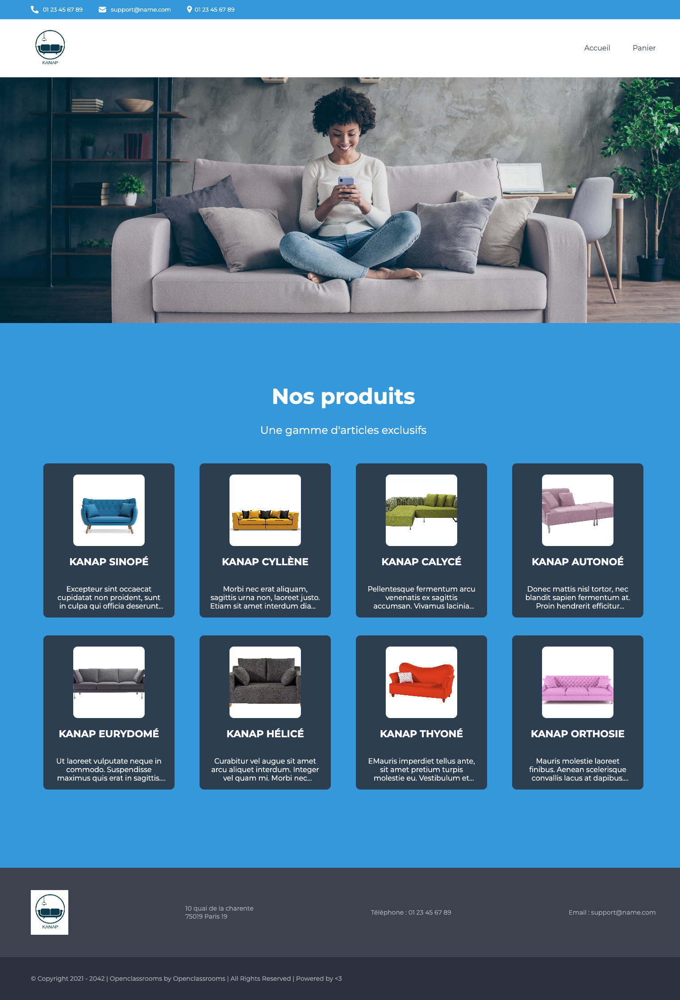

# Kanap

-   Cinquième projet du parcours "Développeur web" chez OpenClassroom.

## Objectifs

1. Interagir avec un web service avec JavaScript
2. Valider des données issues de sources externes
3. Créer un plan de test pour une application
4. Gérer des événements JavaScript

## Livrables

-   Vous trouverez au format PDF, [un document qui récapitule tous les cas de tests réalisés](./Talgorn_Vincent_2_plan_test_072022.pdf).

### Back end Prerequisites

Vous aurez besoin d'avoir Node et `npm` installés localement sur votre machine.

### Back end Installation

-   Clonez ce dépôt. Depuis le dossier "back" du projet, exécutez `npm install`. Vous pourrez alors exécuter le serveur avec `node server`.
-   Il suffit de se positionner dans le dossier backend avec un terminal et de saisir la commande node start Par défaut le serveur sera lancé sur le port 3000 ( http://localhost:3000 ).

### Front end

-   Le frontend présente la partie utilisateur de l'application. Il doit être lancé avec un serveur local (live server avec vscode par exemple), et nécessite que le backend soit lancé lui aussi pour fonctionner correctement.

## Contact

Vous pouvez me contacter sur le [workplace d'openclassrooms](https://openclassrooms.workplace.com/profile.php?id=100081178936136), sur [twitter](https://twitter.com/TalgornVincent) ou sur mon [adresse mail](mailto:talgorn.v@gmail.com).
